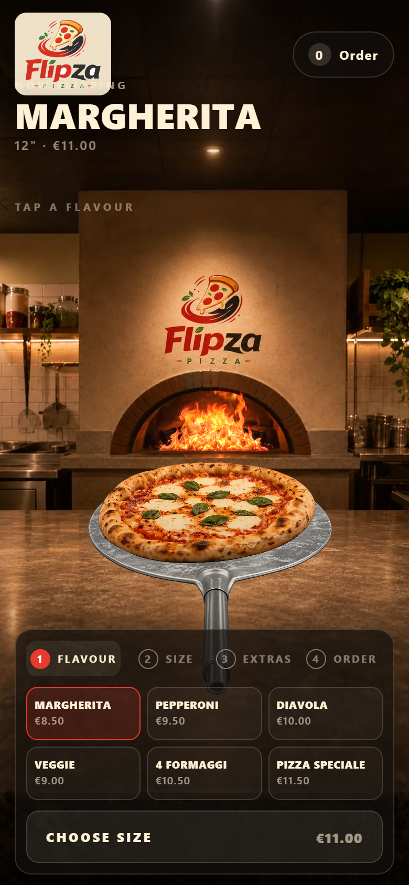

# Flipza

A pizza storefront that is **one screen, never scrolled**. The pizza on the peel
is the product view; choosing a flavour tosses it, and the toss is the
transition between every state rather than a decoration on top of one. The fire
in the oven behind it is running the whole time.

You order by tapping: flavour → size → extras → the pizza goes in a box →
checkout. Every step is something you watch happen on the counter - the pizza
grows when you pick a size, the extras you add land on it and stay there, the
lid closes over it and the box joins the pile at the back, and the fries and
cola you say yes to are set down beside it.



## Run it

```sh
npm install
npm run dev          # http://localhost:5173
```

`npm run dev` rebuilds the runtime assets first (a few seconds), then serves.

**On a machine with reduced motion, open `?motion=on`.** Windows Server ships
with "Show animations in Windows" off, Chrome reports that as
`prefers-reduced-motion: reduce`, and the site honours it - so the pizza cuts
between flavours, the fire holds a frame and none of this is visible. It is an
OS setting, not a bug. See `_CONTINUE-HERE.md`.

## Build

```sh
npm run build        # -> dist/
npm run standalone   # -> flipza.html, one file, opens off disk
npm run deploy       # build and push dist/ to the gh-pages branch
```

## Where things are

```
src/scene.ts                  the toss, as a pure function of one number
src/menu.ts                   what can be ordered and what it costs
src/render/renderer.ts        the canvas: plate, fire, peel, pizza, box, toppings
src/render/loader.ts          go interactive on ~8 images, stream the rest
src/components/OrderScene.tsx the order machine and the animation sequences
src/components/Dock.tsx       the step rail and the sliding option panels

sprites-src/   nine tumble poses per flavour, plus the peel and the kitchen
oven-src/      the flame frames and the flameless oven cavity
props-src/     the box in three states, and a sheet of pieces per extra
portrait-src/  the kitchen extended vertically, for phone screens

scripts/gen-*.mjs       generate art through the local Gemini Studio dashboard
scripts/prepare-*.mjs   key, measure, cut and pack it into public/
tools/shot.mjs          drive the site through CDP and screenshot it
```

Sources are stored as **lossless WebP** - the same pixels as the PNGs the
generators write, in about 40% of the bytes. Everything the browser loads is
WebP too: about 600KB before the site is interactive, and 3.4MB in total for
all 55 pizza sprites, 18 flame frames, 51 topping pieces, the box, the sides
and the kitchen. Sprites come in two sets and a screen only ever downloads the
one it can show.

## Adding a flavour

```sh
GEMINI_STUDIO_TOKEN=<token> node scripts/gen-flavor.mjs <name>
npm run to-webp
npm run dev
```

The flavour list is discovered from filenames, so it appears in the UI as soon
as its nine poses exist. Only a name that differs from its slug needs an entry
in `LABELS` (`formaggi` → `4 FORMAGGI`), and only a price needs one in
`FLAVOR_INFO`.

## Not a real shop

There is no payment, no account and no kitchen at the other end. It is a
storefront demo; the order flow ends at a confirmation panel that says so.
